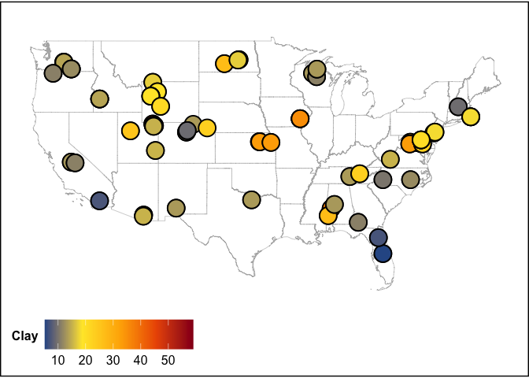

Exploration
================

------------------------------------------------------------------------

### BASIC EXPLORATION

<!-- -->

------------------------------------------------------------------------

### CORRELATIONS AND PCAs

<!-- -->

<!-- -->

------------------------------------------------------------------------

### MAPS

<!-- --><!-- --><!-- --><!-- --><!-- --><!-- --><!-- --><!-- --><!-- --><!-- --><!-- --><!-- --><!-- --><!-- --><!-- --><!-- --><!-- --><!-- --><!-- -->

------------------------------------------------------------------------

## Session Info

Session Info

Date run: 2023-10-12

    ## R version 4.2.1 (2022-06-23)
    ## Platform: x86_64-apple-darwin17.0 (64-bit)
    ## Running under: macOS Big Sur ... 10.16
    ## 
    ## Matrix products: default
    ## BLAS:   /Library/Frameworks/R.framework/Versions/4.2/Resources/lib/libRblas.0.dylib
    ## LAPACK: /Library/Frameworks/R.framework/Versions/4.2/Resources/lib/libRlapack.dylib
    ## 
    ## locale:
    ## [1] en_US.UTF-8/en_US.UTF-8/en_US.UTF-8/C/en_US.UTF-8/en_US.UTF-8
    ## 
    ## attached base packages:
    ## [1] stats     graphics  grDevices utils     datasets  methods   base     
    ## 
    ## other attached packages:
    ##  [1] ggbiplot_0.55   ggthemes_4.2.4  sf_1.0-8        maptools_1.1-4 
    ##  [5] sp_1.5-0        lubridate_1.9.2 forcats_1.0.0   stringr_1.5.0  
    ##  [9] dplyr_1.1.0     purrr_1.0.1     readr_2.1.4     tidyr_1.3.0    
    ## [13] tibble_3.1.8    ggplot2_3.4.3   tidyverse_2.0.0
    ## 
    ## loaded via a namespace (and not attached):
    ##  [1] Rcpp_1.0.11        lattice_0.20-45    class_7.3-20       digest_0.6.29     
    ##  [5] utf8_1.2.2         R6_2.5.1           cellranger_1.1.0   plyr_1.8.7        
    ##  [9] ggcorrplot_0.1.4   evaluate_0.16      e1071_1.7-11       highr_0.9         
    ## [13] pillar_1.8.1       soilpalettes_0.1.0 rlang_1.1.1        readxl_1.4.2      
    ## [17] rstudioapi_0.14    rmarkdown_2.21     labeling_0.4.2     foreign_0.8-82    
    ## [21] munsell_0.5.0      proxy_0.4-27       compiler_4.2.1     xfun_0.37         
    ## [25] pkgconfig_2.0.3    htmltools_0.5.3    tidyselect_1.2.0   fansi_1.0.3       
    ## [29] tzdb_0.3.0         withr_2.5.0        wk_0.6.0           grid_4.2.1        
    ## [33] gtable_0.3.0       lifecycle_1.0.3    DBI_1.1.3          magrittr_2.0.3    
    ## [37] units_0.8-0        scales_1.2.1       KernSmooth_2.23-20 cli_3.6.0         
    ## [41] stringi_1.7.8      farver_2.1.1       reshape2_1.4.4     ellipsis_0.3.2    
    ## [45] generics_0.1.3     vctrs_0.5.2        s2_1.1.0           tools_4.2.1       
    ## [49] glue_1.6.2         hms_1.1.2          fastmap_1.1.0      yaml_2.3.5        
    ## [53] timechange_0.2.0   colorspace_2.0-3   classInt_0.4-7     knitr_1.42

